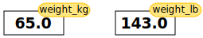

::::::::::::::::::::::::::::::::::::::: objectives
- Become familiar with mathematical operators and in-built functions.
- Become confident using the console to run mathematical operations.
- Understand the order of operations.
::::::::::::::::::::::::::::::::::::::::::::::::::

:::::::::::::::::::::::::::::::::::::::: questions

- How do we process mathematical operations in Spyder?
::::::::::::::::::::::::::::::::::::::::::::::::::

## Variables

To do anything useful with data, we need to assign its value to a *variable*.
In Python, we can [assign](../learners/reference.md#assign) a value to a
[variable](../learners/reference.md#variable), using the equals sign `=`.
For example, we can track the weight of a patient who weighs 60 kilograms by
assigning the value `60` to a variable `weight_kg`:

```python
weight_kg = 60
```

From now on, whenever we use `weight_kg`, Python will substitute the value we assigned to
it. In layperson's terms, **a variable is a name for a value**.

In Python, variable names can be:

* Variable names are cases sensitive (My_name is different to my_name).  

* They must start with a letter or a underscore. 

* They can consist of letters, numbers, periods, and underscores.  

* There are reserved words (e.g., ‘else’, ‘for’) that cannot be used for naming variables as they are already used by Python for specific purposes.  

This means that, for example:

- `weight0` is a valid variable name, whereas `0weight` is not
- `weight` and `Weight` are different variables

 
It may seem fussy but there are actually not that many enforced restrictions compared to the number of variable naming combinations. However, just because you can, doesn’t mean you should. There exist several naming conventions in the Python community to help provide structure and guidance to variable naming. 

 

1. my_variable (underscore or snake case) 

2. myVariable (camel case) 

 

Although some may disagree with us, we believe for most users it does not matter which convention you pick. There are two key principles for variable naming, that we recommend, that should make your life easier: 

 

1. ***Consistency*** – pick a convention and stick with it. 

2. ***Succinctness*** - Keep variable names short, readable, and descriptive. 

 

For ***example***, if you wanted a variable name for a temperature reading taken in Aberystwyth: 


This: 

>min_temp_aber_C 


Is better than this: 

>temp 
 

Or this: 

>themininimumtemperaturerecordedfromaberystwythindegreescelcius 

 
Being consistent, aware of context, and conscious of your variable naming will make reading your code easier and decrease the risk of errors.   


## Types of data

### Data types 
Python utilises different data types to efficiently store and manipulate different kinds of data. Python is dynamical typed; this means that you do not need to specify a data type when you declare a variable. You can give the variable name and the data you want to store and let Python worry about how it deals with that. We will look at the most common data types in Python.
  
| Data Type       | Description                                     | Example                     |
|-----------------|-------------------------------------------------|-----------------------------|
| int             | Integer data type                               | 42                          |
| float           | Floating-point data type                        | 3.14                        |
| str             | String data type                                | 'hello'                     |
| bool            | Boolean data type                               | True, False                 |
| NoneType        | NoneType data type (represents null value)      | None                        |

In the example above, variable `weight_kg` has an integer value of `60`.
If we want to more precisely track the weight of our patient,
we can use a floating point value by executing:

```python
weight_kg = 60.3
```

To create a string, we add single or double quotes around some text.
To identify and track a patient throughout our study,
we can assign each person a unique identifier by storing it in a string:

```python
patient_id = '001'
```

## Using Variables in Python

Once we have data stored with variable names, we can make use of it in calculations.
We may want to store our patient's weight in pounds as well as kilograms:

```python
weight_lb = 2.2 * weight_kg
```

We might decide to add a prefix to our patient identifier:

```python
patient_id = 'inflam_' + patient_id
```

## Built-in Python functions

To carry out common tasks with data and variables in Python,
the language provides us with several built-in [functions](../learners/reference.md#function).
To display information to the screen, we use the `print` function:

```python
print(weight_lb)
print(patient_id)
```

```output
132.66
inflam_001
```

When we want to make use of a function, referred to as calling the function,
we follow its name by parentheses. The parentheses are important:
if you leave them off, the function doesn't actually run!
Sometimes you will include values or variables inside the parentheses for the function to use.
In the case of `print`,
we use the parentheses to tell the function what value we want to display.
We will learn more about how functions work and how to create our own in later episodes.

We can display multiple things at once using only one `print` call:

```python
print(patient_id, 'weight in kilograms:', weight_kg)
```

```output
inflam_001 weight in kilograms: 60.3
```

We can also call a function inside of another
[function call](../learners/reference.md#function-call).
For example, Python has a built-in function called `type` that tells you a value's data type:

```python
print(type(60.3))
print(type(patient_id))
```

```output
<class 'float'>
<class 'str'>
```

Moreover, we can do arithmetic with variables right inside the `print` function:

```python
print('weight in pounds:', 2.2 * weight_kg)
```

```output
weight in pounds: 132.66
```

The above command, however, did not change the value of `weight_kg`:

```python
print(weight_kg)
```

```output
60.3
```

To change the value of the `weight_kg` variable, we have to
**assign** `weight_kg` a new value using the equals `=` sign:

```python
weight_kg = 65.0
print('weight in kilograms is now:', weight_kg)
```

```output
weight in kilograms is now: 65.0
```


:::::::::::::::::::::::::::::::::::::::::  callout

## Variables as Sticky Notes

A variable in Python is analogous to a sticky note with a name written on it:
assigning a value to a variable is like putting that sticky note on a particular value.

{alt='Value of 65.0 with weight\_kg label stuck on it'}

Using this analogy, we can investigate how assigning a value to one variable
does **not** change values of other, seemingly related, variables.  For
example, let's store the subject's weight in pounds in its own variable:

```python
# There are 2.2 pounds per kilogram
weight_lb = 2.2 * weight_kg
print('weight in kilograms:', weight_kg, 'and in pounds:', weight_lb)
```

```output
weight in kilograms: 65.0 and in pounds: 143.0
```

Everything in a line of code following the '#' symbol is a
[comment](../learners/reference.md#comment) that is ignored by Python.
Comments allow programmers to leave explanatory notes for other
programmers or their future selves.

{alt='Value of 65.0 with weight\_kg label stuck on it, and value of 143.0 with weight\_lb label stuck on it'}

Similar to above, the expression `2.2 * weight_kg` is evaluated to `143.0`,
and then this value is assigned to the variable `weight_lb` (i.e. the sticky
note `weight_lb` is placed on `143.0`). At this point, each variable is
"stuck" to completely distinct and unrelated values.

Let's now change `weight_kg`:

```python
weight_kg = 100.0
print('weight in kilograms is now:', weight_kg, 'and weight in pounds is still:', weight_lb)
```

```output
weight in kilograms is now: 100.0 and weight in pounds is still: 143.0
```

{alt='Value of 100.0 with label weight\_kg stuck on it, and value of 143.0 with label weight\_lbstuck on it'}

Since `weight_lb` doesn't "remember" where its value comes from,
it is not updated when we change `weight_kg`.


::::::::::::::::::::::::::::::::::::::::::::::::::

:::::::::::::::::::::::::::::::::::::::  challenge

## Check Your Understanding

What values do the variables `mass` and `age` have after each of the following statements?
Test your answer by executing the lines.

```python
mass = 47.5
age = 122
mass = mass * 2.0
age = age - 20
```

:::::::::::::::  solution

## Solution

```output
`mass` holds a value of 47.5, `age` does not exist
`mass` still holds a value of 47.5, `age` holds a value of 122
`mass` now has a value of 95.0, `age`'s value is still 122
`mass` still has a value of 95.0, `age` now holds 102
```

:::::::::::::::::::::::::

::::::::::::::::::::::::::::::::::::::::::::::::::

:::::::::::::::::::::::::::::::::::::::  challenge

## Sorting Out References

Python allows you to assign multiple values to multiple variables in one line by separating
the variables and values with commas. What does the following program print out?

```python
first, second = 'Grace', 'Hopper'
third, fourth = second, first
print(third, fourth)
```

:::::::::::::::  solution

## Solution

```output
Hopper Grace
```

:::::::::::::::::::::::::

::::::::::::::::::::::::::::::::::::::::::::::::::

:::::::::::::::::::::::::::::::::::::::  challenge

## Seeing Data Types

What are the data types of the following variables?

```python
planet = 'Earth'
apples = 5
distance = 10.5
```

:::::::::::::::  solution

## Solution

```python
print(type(planet))
print(type(apples))
print(type(distance))
```

```output
<class 'str'>
<class 'int'>
<class 'float'>
```

:::::::::::::::::::::::::

::::::::::::::::::::::::::::::::::::::::::::::::::

## Running code in order

Jupyter notebooks keep variables, imports, and results in memory as you run cells. That means each cell can depend on work done earlier. When cells are run out of order, the notebook can end up in a weird state where the code looks fine but behaves unpredictably.

### Main reason

### Running cells in order makes the notebook:

* easier to understand
* easier to debug
* easier for other people to reproduce
* less likely to break because of hidden state
* Simple explanation

A notebook is not just a document. It is also a live session.
If you run cell 8 before cell 3, cell 8 might still work only because something was defined earlier in a previous run. But another person opening the notebook fresh will get an error.

### Examples

```python
# Cell 1
x = 10
```

```python
# Cell 2
y = x + 5
print(y)
```
If Cell 2 is run before Cell 1, Python will raise an error because x does not exist yet.

Now imagine this:

```python
# Cell 1
x = 10
```

```python
# Cell 2
x = 25
print(y)
```

```python
# Cell 2
x = 25
print(y)
```


:::::::::::::::::::::::::::::::::::::::: keypoints

- Basic data types in Python include integers, strings, and floating-point numbers.
- Use `variable = value` to assign a value to a variable in order to record it in memory.
- Variables are created on demand whenever a value is assigned to them.
- Use `print(something)` to display the value of `something`.
- Use `# some kind of explanation` to add comments to programs.
- Built-in functions are always available to use.
- Use `help(thing)` to view help for something.
- Error messages provide information about what has gone wrong with your program and where.

::::::::::::::::::::::::::::::::::::::::::::::::::


