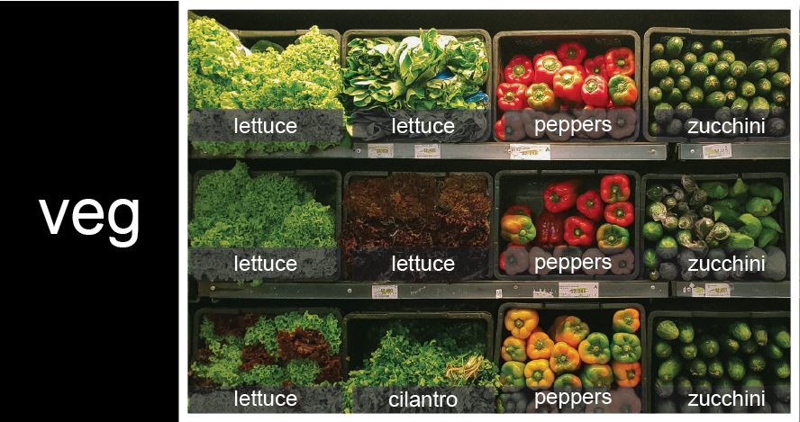
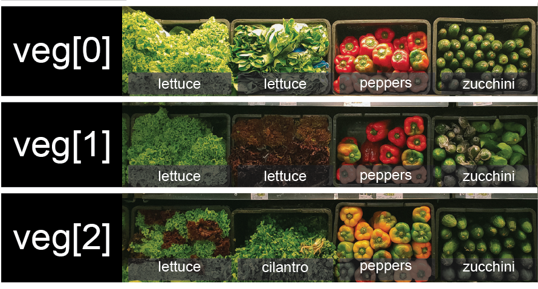

::::::::::::::::::::::::::::::::::::::: objectives

- Understand why data structures are useful for storing multiple values.
- Create, inspect, index, and modify data structures in Python.
- Understand the difference between mutable and immutable objects.
- Understand that data structures can be nested to suit our storage needs.


::::::::::::::::::::::::::::::::::::::::::::::::::

:::::::::::::::::::::::::::::::::::::::: questions

- What is the difference between a list and a dictionary?
- Why do we use a list or dictionary instead of lots of separate variables?
- When is one data structure a better choice than another?
- How do I get a value out of a data structure?
- Can I get multiple values out of a data structure?

::::::::::::::::::::::::::::::::::::::::::::::::::


## Python lists

We create a list by putting values inside square brackets and separating the values with commas:

```python
odds = [1, 3, 5, 7]
print('odds are:', odds)
```

```output
odds are: [1, 3, 5, 7]
```

We can access elements of a list using indices -- numbered positions of elements in the list.
These positions are numbered starting at 0, so the first element has an index of 0.

```python
print('first element:', odds[0])
print('last element:', odds[3])
print('"-1" element:', odds[-1])
```

```output
first element: 1
last element: 7
"-1" element: 7
```

Yes, we can use negative numbers as indices in Python. When we do so, the index `-1` gives us the
last element in the list, `-2` the second to last, and so on.
Because of this, `odds[3]` and `odds[-1]` point to the same element here.

There is one important difference between lists and strings:
we can change the values in a list,
but we cannot change individual characters in a string.
For example:

```python
names = ['Curie', 'Darwing', 'Turing']  # typo in Darwin's name
print('names is originally:', names)
names[1] = 'Darwin'  # correct the name
print('final value of names:', names)
```

```output
names is originally: ['Curie', 'Darwing', 'Turing']
final value of names: ['Curie', 'Darwin', 'Turing']
```


:::::::::::::::::::::::::::::::::::::::::  callout

## Ch-Ch-Ch-Ch-Changes

Mutable data (like lists and arrays) can be changed after creation, while immutable data (like strings and numbers) cannot be modified, only replaced.
Modifying mutable objects in place can lead to unexpected behaviour if multiple variables reference the same data.
To avoid this, you can create a copy so changes do not affect the original.
In-place changes are more efficient but can make code harder to understand, so there is a trade-off between clarity and performance.

```python
mild_salsa = ['peppers', 'onions', 'cilantro']
hot_salsa = mild_salsa        # <-- mild_salsa and hot_salsa point to the *same* list data in memory
hot_salsa[0] = 'hot peppers'
print('Ingredients in mild salsa:', mild_salsa)
print('Ingredients in hot salsa:', hot_salsa)
```
```output
Ingredients in mild salsa: ['hot peppers', 'onions', 'cilantro']
Ingredients in hot salsa: ['hot peppers', 'onions', 'cilantro']
```

If you want variables with mutable values to be independent, you
must make a copy of the value when you assign it.

```python
mild_salsa = ['peppers', 'onions', 'cilantro']
hot_salsa = mild_salsa.copy()        # <-- hot_salsa is now a copy of the original
hot_salsa[0] = 'hot peppers'
print('Ingredients in mild salsa:', mild_salsa)
print('Ingredients in hot salsa:', hot_salsa)
```

```output
Ingredients in mild salsa: ['peppers', 'onions', 'cilantro']
Ingredients in hot salsa: ['hot peppers','onions', 'cilantro']
```

::::::::::::::::::::::::::::::::::::::::::::::::::

:::::::::::::::::::::::::::::::::::::::::  callout

## Nested Lists

Since a list can contain any Python variables, it can even contain other lists.

For example, you could represent the products on the shelves of a small grocery shop
as a nested list called `veg`:

{alt='veg is represented as a shelf full of produce. There are three rows of vegetables on the shelf, and each row contains three baskets of vegetables. We can label each basket according to the type of vegetable it contains, so the top row contains (from left to right) lettuce, lettuce, and peppers.'}

To store the contents of the shelf in a nested list, you write it this way:

```python
veg = [['lettuce', 'lettuce', 'peppers', 'zucchini'],
     ['lettuce', 'lettuce', 'peppers', 'zucchini'],
     ['lettuce', 'cilantro', 'peppers', 'zucchini']]
```

Here are some visual examples of how indexing a list of lists `veg` works. First,
you can reference each row on the shelf as a separate list. For example, `veg[2]`
represents the bottom row, which is a list of the baskets in that row.

{alt='veg is now shown as a list of three rows, with veg\[0\] representing the top row of three baskets, veg\[1\] representing the second row, and veg\[2\] representing the bottom row.'}

Index operations using the image would work like this:

```python
print(veg[2])
```

```output
['lettuce', 'cilantro', 'peppers', 'zucchini']
```

```python
print(veg[0])
```

```output
['lettuce', 'lettuce', 'peppers', 'zucchini']
```

To reference a specific basket on a specific shelf, you use two indexes. The first
index represents the row (from top to bottom) and the second index represents
the specific basket (from left to right).
{alt='veg is now shown as a two-dimensional grid, with each basket labeled according to its index in the nested list. The first index is the row number and the second index is the basket number, so veg\[1\]\[3\] represents the basket on the far right side of the second row (basket 4 on row 2): zucchini'}

```python
print(veg[0][0])
```

```output
'lettuce'
```

```python
print(veg[1][2])
```

```output
'peppers'
```

::::::::::::::::::::::::::::::::::::::::::::::::::

:::::::::::::::::::::::::::::::::::::::::  callout

## Heterogeneous Lists

Lists in Python can contain elements of different types. Example:

```python
sample_ages = [10, 12.5, 'Unknown']
```

::::::::::::::::::::::::::::::::::::::::::::::::::

There are many ways to change the contents of lists besides assigning new values to
individual elements:

### Adding to list

To append an item to a list 

```python
odds.append(11)
print('odds after adding a value:', odds)
```

### Removing elements

```python
removed_element = odds.pop(0)
print('odds after removing the first element:', odds)
print('removed_element:', removed_element)
```
### List slicing

If you want to take a slice from the beginning of a sequence, you can omit the first index in the
range:

```python
date = 'Monday 4 January 2016'
day = date[0:6]
print('Using 0 to begin range:', day)
day = date[:6]
print('Omitting beginning index:', day)
```

```output
Using 0 to begin range: Monday
Omitting beginning index: Monday
```

And similarly, you can omit the ending index in the range to take a slice to the very end of the
sequence:

```python
months = ['jan', 'feb', 'mar', 'apr', 'may', 'jun', 'jul', 'aug', 'sep', 'oct', 'nov', 'dec']
sond = months[8:12]
print('With known last position:', sond)
sond = months[8:len(months)]
print('Using len() to get last entry:', sond)
sond = months[8:]
print('Omitting ending index:', sond)
```

```output
With known last position: ['sep', 'oct', 'nov', 'dec']
Using len() to get last entry: ['sep', 'oct', 'nov', 'dec']
Omitting ending index: ['sep', 'oct', 'nov', 'dec']
```

:::::::::::::::::::::::::::::::::::::::  challenge

## Slicing From the End

Use slicing to access only the last four characters of a string or entries of a list.

```python
string_for_slicing = 'Observation date: 02-Feb-2013'
list_for_slicing = [['fluorine', 'F'],
                    ['chlorine', 'Cl'],
                    ['bromine', 'Br'],
                    ['iodine', 'I'],
                    ['astatine', 'At']]
```

```output
'2013'
[['chlorine', 'Cl'], ['bromine', 'Br'], ['iodine', 'I'], ['astatine', 'At']]
```

Would your solution work regardless of whether you knew beforehand
the length of the string or list
(e.g. if you wanted to apply the solution to a set of lists of different lengths)?
If not, try to change your approach to make it more robust.

Hint: Remember that indices can be negative as well as positive

:::::::::::::::  solution

## Solution

Use negative indices to count elements from the end of a container (such as list or string):

```python
string_for_slicing[-4:]
list_for_slicing[-4:]
```

:::::::::::::::::::::::::

::::::::::::::::::::::::::::::::::::::::::::::::::

:::::::::::::::::::::::::::::::::::::::  challenge

## Non-Continuous Slices

So far we've seen how to use slicing to take single blocks
of successive entries from a sequence.
But what if we want to take a subset of entries
that aren't next to each other in the sequence?

You can achieve this by providing a third argument
to the range within the brackets, called the *step size*.
The example below shows how you can take every third entry in a list:

```python
primes = [2, 3, 5, 7, 11, 13, 17, 19, 23, 29, 31, 37]
subset = primes[0:12:3]
print('subset', subset)
```

```output
subset [2, 7, 17, 29]
```

Notice that the slice taken begins with the first entry in the range,
followed by entries taken at equally-spaced intervals (the steps) thereafter.
If you wanted to begin the subset with the third entry,
you would need to specify that as the starting point of the sliced range:

```python
primes = [2, 3, 5, 7, 11, 13, 17, 19, 23, 29, 31, 37]
subset = primes[2:12:3]
print('subset', subset)
```

```output
subset [5, 13, 23, 37]
```

Use the step size argument to create a new string
that contains only every other character in the string
"In an octopus's garden in the shade". Start with
creating a variable to hold the string:

```python
beatles = "In an octopus's garden in the shade"
```

What slice of `beatles` will produce the
following output (i.e., the first character, third
character, and every other character through the end
of the string)?

```output
I notpssgre ntesae
```

:::::::::::::::  solution

## Solution

To obtain every other character you need to provide a slice with the step
size of 2:

```python
beatles[0:35:2]
```

You can also leave out the beginning and end of the slice to take the whole string
and provide only the step argument to go every second
element:

```python
beatles[::2]
```

:::::::::::::::::::::::::

::::::::::::::::::::::::::::::::::::::::::::::::::


## Dictionaries

* Dictionaries store key-value pairs and are accessed using keys rather than numeric positions.
* They are mutable, and keys are often strings or numbers.
* Dictionaries are created using curly braces \{\}.

Example of dictionary creation:

```python
my_dict = {'name': 'John', 'age': 30, 'city': 'New York'}
```

### Accessing elements:
* Elements in a dictionary are accessed using square brackets \[\] and keys.

Example of accessing elements:
```python
person_name = my_dict['name']   # Accessing value corresponding to 'name' key
```


### Manipulating dictionaries:
* Dictionaries support various operations like adding, removing, and updating key-value pairs.

Examples of manipulation:
```python
my_dict['gender'] = 'Male'     # Adds 'gender': 'Male' to the dictionary
del my_dict['age']             # Removes the key 'age' and its value
my_dict['city'] = 'Los Angeles' # Updates the value of 'city' key to 'Los Angeles'
```

## Why do we need different data structures?

We need different data structures because data does not always come in the same form.

Sometimes we want to store values in a simple ordered collection. A **list** is good for this. For example, a list works well for a sequence of numbers, names, or measurements where the position of each item matters.

Sometimes we want to store values with labels. A **dictionary** is good for this. For example, if we want to store a person's name, age, and job, it is more useful to label each value than to rely on its position.

So, lists and dictionaries are both ways of storing multiple values, but they are designed for different purposes. A list helps us work with **order**, while a dictionary helps us work with **meaningful labels**.

We also need to consider how information is accessed when working with data at scale, particularly when thinking about how efficiently we can search for values within different data structures.

:::::::::::::::::::::::::::::::::::::::: keypoints

- `[value1, value2, value3, ...]` creates a list, (this process does not have to be manual).
- Lists can contain any Python object, including lists (i.e., list of lists).
- Lists are indexed and sliced with square brackets (e.g., `list[0]` and `list[2:9]`), in the same way as strings and arrays.
- Dictionaries are indexed with the key (e.g., dictionary['first_entry'])
- Some objects are mutable (e.g., lists).
- Some objects are immutable (e.g., strings).
- Different data structures exist because they support different ways of organising and accessing information.

::::::::::::::::::::::::::::::::::::::::::::::::::


