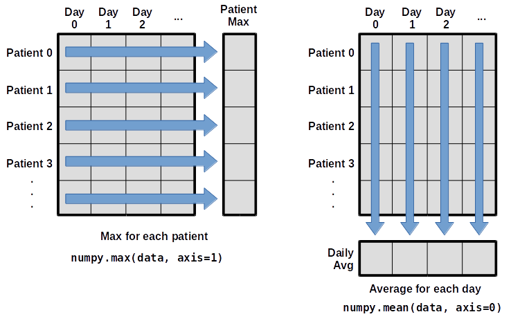

::::::::::::::::::::::::::::::::::::::: objectives

- Read tabular data from a file.
- Select individual values and subsections from data.
- Perform operations on arrays of data.

::::::::::::::::::::::::::::::::::::::::::::::::::

:::::::::::::::::::::::::::::::::::::::: questions

- How do I get data into Python?
- How can I work on the data?
- What if my data is not numbers?

::::::::::::::::::::::::::::::::::::::::::::::::::

Words are useful, but what's more useful are the sentences and stories we build with them.
Similarly, while a lot of powerful, general tools are built into Python,
specialised tools for working with data are available in
[libraries](../learners/reference.md#library)
that can be called upon when needed.

## Loading data into Python

To begin processing the clinical trial inflammation data, we need to load it into Python.
We can do that using a library called
[NumPy](https://numpy.org/doc/stable "NumPy Documentation"), which stands for Numerical Python.
In general, you should use this library when you want to work efficiently with large collections of numbers,
especially if you have matrices or arrays. To tell Python that we'd like to start using NumPy,
we need to [import](../learners/reference.md#import) it:

```python
import numpy
```

Importing a library is like getting a piece of lab equipment out of a storage locker and setting it
up on the bench. Libraries provide additional functionality beyond basic Python, much like a new piece of equipment adds functionality to a lab space.
Importing too many libraries can sometimes complicate and bloat your code, so we only import what we
actually need for each program.

Once we've imported the library, we can ask the library to read our data file for us:

```python
import numpy
numpy.loadtxt(fname='inflammation-01.csv', delimiter=',')
```

```output
array([[ 0.,  0.,  1., ...,  3.,  0.,  0.],
       [ 0.,  1.,  2., ...,  1.,  0.,  1.],
       [ 0.,  1.,  1., ...,  2.,  1.,  1.],
       ...,
       [ 0.,  1.,  1., ...,  1.,  1.,  1.],
       [ 0.,  0.,  0., ...,  0.,  2.,  0.],
       [ 0.,  0.,  1., ...,  1.,  1.,  0.]])
```

The expression `numpy.loadtxt(...)` is a
[function call](../learners/reference.md#function-call)
that asks Python to run the [function](../learners/reference.md#function) `loadtxt` which
belongs to the `numpy` library.
The dot is used to access something that belongs to an object, such as a value or a function. For example, `object.property` accesses a value, and `object_name.method()` calls a method.

You can think of the dot like opening a toolbox and picking out a specific tool.
The library is the toolbox, and the function is one of the tools inside it.
So in numpy.loadtxt, numpy is the toolbox and loadtxt is the tool we want to use.

`numpy.loadtxt` has two [parameters](../learners/reference.md#parameter): the name of the file
we want to read and the [delimiter](../learners/reference.md#delimiter) that separates values
on a line. These both need to be [strings](../learners/reference.md#string), so we put them in quotes.

Since we haven't told it to do anything else with the function's output,
the [notebook](../learners/reference.md#notebook) displays it.
In this case,
that output is the data we just loaded.
By default,
only a few rows and columns are shown
(with `...` to omit elements when displaying big arrays).
Note that, to save space when displaying NumPy arrays, Python does not show us trailing zeros,
so `1.0` becomes `1.`.

Our call to `numpy.loadtxt` read our file
but didn't save the data in memory.
To do that,
we need to assign the array to a variable. In a similar manner to how we assign a single
value to a variable, we can also assign an array of values to a variable using the same syntax.
Let's re-run `numpy.loadtxt` and save the returned data:

```python
data = numpy.loadtxt(fname='inflammation-01.csv', delimiter=',')
```

This statement doesn't produce any output because we've assigned the output to the variable `data`.
If we want to check that the data have been loaded,
we can print the variable's value:

```python
print(data)
```

```output
[[ 0.  0.  1. ...,  3.  0.  0.]
 [ 0.  1.  2. ...,  1.  0.  1.]
 [ 0.  1.  1. ...,  2.  1.  1.]
 ...,
 [ 0.  1.  1. ...,  1.  1.  1.]
 [ 0.  0.  0. ...,  0.  2.  0.]
 [ 0.  0.  1. ...,  1.  1.  0.]]
```


With the following command, we can see the array's [shape](../learners/reference.md#shape):

```python
print(data.shape)
```

```output
(60, 40)
```

The output tells us that the `data` array variable contains 60 rows and 40 columns. When we
created the variable `data` to store our inflammation data, we did not only create the array; we also
created information about the array, called attributes. This extra information describes `data` in the same way an adjective describes a noun.
`data.shape` is an attribute of `data` which describes the dimensions of `data`. We use the same
dotted notation for the attributes of variables that we use for the functions in libraries because
they have the same part-and-whole relationship.

If we want to get a single number from the array, we must provide an
[index](../learners/reference.md#index) in square brackets after the variable name, just as we
would do in mathematics when referring to an element of a matrix.  Our inflammation data has two dimensions, so
we will need to use two indices to refer to one specific value:

```python
print('first value in data:', data[0, 0])
```

```output
first value in data: 0.0
```

```python
print('middle value in data:', data[29, 19])
```

```output
middle value in data: 16.0
```

The expression `data[29, 19]` accesses the element at row 30, column 20. While this expression may
not surprise you,
`data[0, 0]` might.
Programming languages like Fortran, MATLAB and R start counting at 1
because that's what human beings have done for thousands of years.
Languages in the C family (including C++, Java, Perl, and Python) count from 0
because it represents an offset from the first value in the array (the second
value is offset by one index from the first value). This is closer to the way
that computers represent arrays (if you are interested in the historical
reasons behind counting indices from zero, you can read
[Mike Hoye's blog post](https://exple.tive.org/blarg/2013/10/22/citation-needed/)).
As a result,
if we have an M×N array in Python,
its indices go from 0 to M-1 on the first axis
and 0 to N-1 on the second.
It takes a bit of getting used to,
but one way to remember the rule is that
the index is how many steps we have to take from the start to get the item we want.

{alt="'data' is a 3 by 3 numpy array containing row 0: \['A', 'B', 'C'\], row 1: \['D', 'E', 'F'\], and row 2: \['G', 'H', 'I'\]. Starting in the upper left hand corner, data\[0, 0\] = 'A', data\[0, 1\] = 'B',data\[0, 2\] = 'C', data\[1, 0\] = 'D', data\[1, 1\] = 'E', data\[1, 2\] = 'F', data\[2, 0\] = 'G',data\[2, 1\] = 'H', and data\[2, 2\] = 'I', in the bottom right hand corner."}


## Slicing data

An index like `[30, 20]` selects a single element of an array,
but we can select whole sections as well.
For example,
we can select the first ten days (columns) of values
for the first four patients (rows) like this:

```python
print(data[0:4, 0:10])
```

```output
[[ 0.  0.  1.  3.  1.  2.  4.  7.  8.  3.]
 [ 0.  1.  2.  1.  2.  1.  3.  2.  2.  6.]
 [ 0.  1.  1.  3.  3.  2.  6.  2.  5.  9.]
 [ 0.  0.  2.  0.  4.  2.  2.  1.  6.  7.]]
```

The [slice](../learners/reference.md#slice) `0:4` means, "Start at index 0 and go up to,
but not including, index 4". Again, the up-to-but-not-including takes a bit of getting used to,
but the rule is that the difference between the upper and lower bounds is the number of values in
the slice.

We don't have to start slices at 0:

```python
print(data[5:10, 0:10])
```

```output
[[ 0.  0.  1.  2.  2.  4.  2.  1.  6.  4.]
 [ 0.  0.  2.  2.  4.  2.  2.  5.  5.  8.]
 [ 0.  0.  1.  2.  3.  1.  2.  3.  5.  3.]
 [ 0.  0.  0.  3.  1.  5.  6.  5.  5.  8.]
 [ 0.  1.  1.  2.  1.  3.  5.  3.  5.  8.]]
```

We also don't have to include the upper and lower bound on the slice.  If we don't include the lower
bound, Python uses 0 by default; if we don't include the upper, the slice runs to the end of the
axis, and if we don't include either (i.e., if we use ':' on its own), the slice includes
everything:

```python
small = data[:3, 36:]
print('small is:')
print(small)
```

The above example selects rows 0 through 2 and columns 36 through to the end of the array.

```output
small is:
[[ 2.  3.  0.  0.]
 [ 1.  1.  0.  1.]
 [ 2.  2.  1.  1.]]
```

## Analysing data

NumPy has several useful functions that take an array as input to perform operations on its values.
If we want to find the average inflammation for all patients on
all days, for example, we can ask NumPy to compute `data`'s mean value:

```python
print(numpy.mean(data))
```

```output
6.14875
```

`mean` is a [function](../learners/reference.md#function) that takes
an array as an [argument](../learners/reference.md#argument).


Let's use three other NumPy functions to get some descriptive values about the dataset.
We'll also use multiple assignment,
a convenient Python feature that will enable us to do this all in one line.

```python
maxval, minval, stdval = numpy.amax(data), numpy.amin(data), numpy.std(data)

print('maximum inflammation:', maxval)
print('minimum inflammation:', minval)
print('standard deviation:', stdval)
```

Here we've assigned the return value from `numpy.amax(data)` to the variable `maxval`, the value
from `numpy.amin(data)` to `minval`, and so on.

```output
maximum inflammation: 20.0
minimum inflammation: 0.0
standard deviation: 4.61383319712
```
When analysing data, though,
we often want to look at variations in statistical values,
such as the maximum inflammation per patient
or the average inflammation per day.
One way to do this is to create a new temporary array of the data we want,
then ask it to do the calculation:

```python
patient_0 = data[0, :] # 0 on the first axis (rows), everything on the second (columns)
print('maximum inflammation for patient 0:', numpy.amax(patient_0))
```

```output
maximum inflammation for patient 0: 18.0
```

We don't actually need to store the row in a variable of its own.
Instead, we can combine the selection and the function call:

```python
print('maximum inflammation for patient 2:', numpy.amax(data[2, :]))
```

```output
maximum inflammation for patient 2: 19.0
```

What if we need the maximum inflammation for each patient over all days (as in the
next diagram on the left) or the average for each day (as in the
diagram on the right)? As the diagram below shows, we want to perform the
operation across an axis:

{alt="Per-patient maximum inflammation is computed row-wise across all columns using numpy.amax(data, axis=1). Per-day average inflammation is computed column-wise across all rows using numpy.mean(data, axis=0)."}

To find the **maximum inflammation reported for each patient**, you would apply the `max` function moving across the columns (axis 1). To find the **daily average inflammation reported across patients**, you would apply the `mean` function moving down the rows (axis 0). 

To support this functionality, most array functions allow us to specify the axis we want to work on. If we ask for the max across axis 1 (columns in our 2D example), we get:

```python
print(numpy.max(data, axis=1))
```

```output
[18. 18. 19. 17. 17. 18. 17. 20. 17. 18. 18. 18. 17. 16. 17. 18. 19. 19.
 17. 19. 19. 16. 17. 15. 17. 17. 18. 17. 20. 17. 16. 19. 15. 15. 19. 17.
 16. 17. 19. 16. 18. 19. 16. 19. 18. 16. 19. 15. 16. 18. 14. 20. 17. 15.
 17. 16. 17. 19. 18. 18.]
```

As a quick check, we can ask this array what its shape is. We expect 60 patient maximums:

```python
print(numpy.max(data, axis=1).shape)
```

```output
(60,)
```

The expression `(60,)` tells us we have a one-dimensional array of 60 values. This data holds the maximum inflammation recorded for each patient. 

If we ask for the average across/down axis 0 (rows in our 2D example), we get:

```python
print(numpy.mean(data, axis=0))
```

```output
[ 0.          0.45        1.11666667  1.75        2.43333333  3.15
  3.8         3.88333333  5.23333333  5.51666667  5.95        5.9
  8.35        7.73333333  8.36666667  9.5         9.58333333 10.63333333
 11.56666667 12.35       13.25       11.96666667 11.03333333 10.16666667
 10.          8.66666667  9.15        7.25        7.33333333  6.58333333
  6.06666667  5.95        5.11666667  3.6         3.3         3.56666667
  2.48333333  1.5         1.13333333  0.56666667]
```

Check the array shape. We expect 40 averages, one for each day of the study:

```python
print(numpy.mean(data, axis=0).shape)
```

```output
(40,)
```
Similarly, we can apply the `mean` function to axis 1 to get the patients' average inflammation over the duration of the study (60 values). 

```python
print(numpy.mean(data, axis=1))
```
```output
[5.45  5.425 6.1   5.9   5.55  6.225 5.975 6.65  6.625 6.525 6.775 5.8
 6.225 5.75  5.225 6.3   6.55  5.7   5.85  6.55  5.775 5.825 6.175 6.1
 5.8   6.425 6.05  6.025 6.175 6.55  6.175 6.35  6.725 6.125 7.075 5.725
 5.925 6.15  6.075 5.75  5.975 5.725 6.3   5.9   6.75  5.925 7.225 6.15
 5.95  6.275 5.7   6.1   6.825 5.975 6.725 5.7   6.25  6.4   7.05  5.9  ]
```
## Pandas

Pandas is a Python library for data manipulation and analysis, providing powerful data structures like DataFrame and Series along with a wide range of functions for tasks such as data cleaning, preparation, and exploration. It is widely used in data science and machine learning workflows for its ease of use and flexibility.

We will now use the Iris dataset as an example of a dataset that does not just consist of numbers. This allows us to demonstrate some of the strengths of the Pandas library for inspecting structure and contents. To read in the dataset:

```python
import pandas as pd
```


```python
iris_df = pd.read_csv("data/iris.csv")
```


### Inspecting a Dataset
To understand the structure of the Iris dataset, we can use various methods provided by Pandas:

```python
print(iris_df.head())
```

```python
print(iris_df.info())
```

```python
print(iris_df.describe())
```


Understanding the contents and data types of a dataset is important for accurate analysis.

### Manipulating DataFrames
Pandas provides powerful functionalities to manipulate DataFrames. Here are some examples:

### Adding and Removing Columns

Adding:
```python
iris_df['sepal.ratio'] = iris_df['sepal.length'] / iris_df['sepal.width']
```

Removing:
```python
iris_df.drop('variety', axis=1, inplace=True)
```

### Adding and removing rows

Adding:
```python
new_row = {'sepal.length': 5.1, 'sepal.width': 3.5, 'petal.length': 1.4, 'petal.width': 0.2,}
iris_df.loc[len(iris_df)] = new_row
```

Removing:
```python
iris_df.drop(0, inplace=True)
iris_df.reset_index(drop=True, inplace=True)
```

### Subsetting Data

Subsetting allows us to select specific rows or columns based on conditions:

```python
iris_df = pd.read_csv("data/iris.csv") # reset the dataset
# Select rows where 'petal.length' is greater than 5
subset_df = iris_df[iris_df['petal.length'] > 5]
```

```python
# Select rows where 'variety' is 'Setosa' and 'petal.length' is less than 1.5
subset_df = iris_df[(iris_df['variety'] == 'Setosa') & (iris_df['petal.length'] < 1.5)]
```

:::::::::::::::::::::::::::::::::::::::: keypoints

- Remember array indices start at 0, not 1.
- Remember `low:high` to specify a `slice` that includes the indices from `low` to `high-1`.
- It's good practice, especially when you are starting out, to use comments such as `# explanation` to explain what you are doing.
- We have shown some simple examples but you could slice your data in much more complicated ways depending on your requirements.

::::::::::::::::::::::::::::::::::::::::::::::::::


