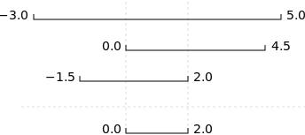

::::::::::::::::::::::::::::::::::::::: objectives

- To be able to read a traceback, and determine where the error took place and what type it is.
- To be able to describe the types of situations in which syntax errors, indentation errors, name errors, index errors, and missing file errors occur.

::::::::::::::::::::::::::::::::::::::::::::::::::

:::::::::::::::::::::::::::::::::::::::: questions

- How does Python report errors?
- How can I handle errors in Python programs?

::::::::::::::::::::::::::::::::::::::::::::::::::

Every programmer encounters errors,
both those who are just beginning,
and those who have been programming for years.
Encountering errors and exceptions can be very frustrating at times,
and can make coding feel like a hopeless endeavour.
However,
understanding what the different types of errors are
and when you are likely to encounter them can help a lot.
Once you know *why* you get certain types of errors,
they become much easier to fix.

Errors in Python have a very specific form,
called a [traceback](../learners/reference.md#traceback).
Let's examine one:

```python
# This code has an intentional error. You can type it directly or
# use it for reference to understand the error message below.
def favorite_ice_cream():
    ice_creams = [
        'chocolate',
        'vanilla',
        'strawberry'
    ]
    print(ice_creams[3])

favorite_ice_cream()
```

```error
---------------------------------------------------------------------------
IndexError                                Traceback (most recent call last)
<ipython-input-1-70bd89baa4df> in <module>()
      9     print(ice_creams[3])
      10
----> 11 favorite_ice_cream()

<ipython-input-1-70bd89baa4df> in favorite_ice_cream()
      7         'strawberry'
      8     ]
----> 9     print(ice_creams[3])
      10
      11 favorite_ice_cream()

IndexError: list index out of range
```

This particular traceback has two levels.
You can determine the number of levels by looking for the number of arrows on the left hand side.
In this case:

1. The first shows code from the cell above,
  with an arrow pointing to Line 11 (which is `favorite_ice_cream()`).

2. The second shows some code in the function `favorite_ice_cream`,
  with an arrow pointing to Line 9 (which is `print(ice_creams[3])`).

The last level is the actual place where the error occurred.
The other level(s) show what function the program executed to get to the next level down.
So, in this case, the program first performed a
[function call](../learners/reference.md#function-call) to the function `favorite_ice_cream`.
Inside this function,
the program encountered an error on Line 6, when it tried to run the code `print(ice_creams[3])`.

:::::::::::::::::::::::::::::::::::::::::  callout

## Long Tracebacks

Sometimes, you might see a traceback that is very long
\-- sometimes they might even be 20 levels deep!
This can make it seem like something horrible happened,
but the length of the error message does not reflect severity, rather,
it indicates that your program called many functions before it encountered the error.
Most of the time, the actual place where the error occurred is at the bottom-most level,
so you can skip down the traceback to the bottom.


::::::::::::::::::::::::::::::::::::::::::::::::::

So what error did the program actually encounter?
In the last line of the traceback,
Python helpfully tells us the category or type of error (in this case, it is an `IndexError`)
and a more detailed error message (in this case, it says "list index out of range").

If you encounter an error and don't know what it means,
it is still important to read the traceback closely.
That way,
if you fix the error,
but encounter a new one,
you can tell that the error changed.
Additionally,
sometimes knowing *where* the error occurred is enough to fix it,
even if you don't entirely understand the message.

If you do encounter an error you don't recognize,
try looking at the
[official documentation on errors](https://docs.python.org/3/library/exceptions.html).
However,
note that you may not always be able to find the error there,
as it is possible to create custom errors.
In that case,
hopefully the custom error message is informative enough to help you figure out what went wrong.

:::::::::::::::::::::::::::::::::::::::  challenge

## Reading Error Messages

Read the Python code and the resulting traceback below, and answer the following questions:

1. How many levels does the traceback have?
2. What is the function name where the error occurred?
3. On which line number in this function did the error occur?
4. What is the type of error?
5. What is the error message?

```python
# This code has an intentional error. Do not type it directly;
# use it for reference to understand the error message below.
def print_message(day):
    messages = [
        'Hello, world!',
        'Today is Tuesday!',
        'It is the middle of the week.',
        'Today is Donnerstag in German!',
        'Last day of the week!',
        'Hooray for the weekend!',
        'Aw, the weekend is almost over.'
    ]
    print(messages[day])

def print_sunday_message():
    print_message(7)

print_sunday_message()
```

```error
---------------------------------------------------------------------------
IndexError                                Traceback (most recent call last)
<ipython-input-7-3ad455d81842> in <module>
     16     print_message(7)
     17 
---> 18 print_sunday_message()
     19 

<ipython-input-7-3ad455d81842> in print_sunday_message()
     14 
     15 def print_sunday_message():
---> 16     print_message(7)
     17 
     18 print_sunday_message()

<ipython-input-7-3ad455d81842> in print_message(day)
     11         'Aw, the weekend is almost over.'
     12     ]
---> 13     print(messages[day])
     14 
     15 def print_sunday_message():

IndexError: list index out of range
```

:::::::::::::::  solution

## Solution

1. 3 levels
2. `print_message`
3. 13
4. `IndexError`
5. `list index out of range` You can then infer that
  `7` is not the right index to use with `messages`.
  
  

:::::::::::::::::::::::::

::::::::::::::::::::::::::::::::::::::::::::::::::

:::::::::::::::::::::::::::::::::::::::::  callout

## Better errors on newer Pythons

Newer versions of Python have improved error printouts.  If you are debugging errors, it is often
helpful to use the latest Python version, even if you support older versions of Python.


::::::::::::::::::::::::::::::::::::::::::::::::::

## Syntax Errors

When you forget a colon at the end of a line,
accidentally add one space too many when indenting under an `if` statement,
or forget a parenthesis,
you will encounter a [syntax error](../learners/reference.md#syntax-error).
This means that Python couldn't figure out how to read your program.
This is similar to forgetting punctuation in English:
for example,
this text is difficult to read there is no punctuation there is also no capitalization
why is this hard because you have to figure out where each sentence ends
you also have to figure out where each sentence begins
to some extent it might be ambiguous if there should be a sentence break or not

People can typically figure out what is meant by text with no punctuation,
but people are much smarter than computers.
If Python doesn't know how to read the program,
it will give up and inform you with an error.
For example:

```python
def some_function()
    msg = 'hello, world!'
    print(msg)
     return msg
```

```error
  File "<ipython-input-3-6bb841ea1423>", line 1
    def some_function()
                       ^
SyntaxError: invalid syntax
```

Here, Python tells us that there is a `SyntaxError` on line 1,
and even puts a little arrow in the place where there is an issue.
In this case the problem is that the function definition is missing a colon at the end.

Actually, the function above has *two* issues with syntax.
If we fix the problem with the colon,
we see that there is *also* an `IndentationError`,
which means that the lines in the function definition do not all have the same indentation:

```python
def some_function():
    msg = 'hello, world!'
    print(msg)
     return msg
```

```error
  File "<ipython-input-4-ae290e7659cb>", line 4
    return msg
    ^
IndentationError: unexpected indent
```

Both `SyntaxError` and `IndentationError` indicate a problem with the syntax of your program,
but an `IndentationError` is more specific:
it *always* means that there is a problem with how your code is indented.

:::::::::::::::::::::::::::::::::::::::::  callout

## Tabs and Spaces

Some indentation errors are harder to spot than others.
In particular, mixing spaces and tabs can be difficult to spot
because they are both [whitespace](../learners/reference.md#whitespace).
In the example below, the first two lines in the body of the function
`some_function` are indented with tabs, while the third line — with spaces.
If you're working in a Jupyter notebook, be sure to copy and paste this example
rather than trying to type it in manually because Jupyter automatically replaces
tabs with spaces.

```python
def some_function():
	msg = 'hello, world!'
	print(msg)
        return msg
```

Visually it is impossible to spot the error.
Fortunately, Python does not allow you to mix tabs and spaces.

```error
  File "<ipython-input-5-653b36fbcd41>", line 4
    return msg
              ^
TabError: inconsistent use of tabs and spaces in indentation
```

::::::::::::::::::::::::::::::::::::::::::::::::::

## Variable Name Errors

Another very common type of error is called a `NameError`,
and occurs when you try to use a variable that does not exist.
For example:

```python
print(a)
```

```error
---------------------------------------------------------------------------
NameError                                 Traceback (most recent call last)
<ipython-input-7-9d7b17ad5387> in <module>()
----> 1 print(a)

NameError: name 'a' is not defined
```

Variable name errors come with some of the most informative error messages,
which are usually of the form "name 'the\_variable\_name' is not defined".

Why does this error message occur?
That's a harder question to answer,
because it depends on what your code is supposed to do.
However,
there are a few very common reasons why you might have an undefined variable.
The first is that you meant to use a
[string](../learners/reference.md#string), but forgot to put quotes around it:

```python
print(hello)
```

```error
---------------------------------------------------------------------------
NameError                                 Traceback (most recent call last)
<ipython-input-8-9553ee03b645> in <module>()
----> 1 print(hello)

NameError: name 'hello' is not defined
```

The second reason is that you might be trying to use a variable that does not yet exist.
In the following example,
`count` should have been defined (e.g., with `count = 0`) before the for loop:

```python
for number in range(10):
    count = count + number
print('The count is:', count)
```

```error
---------------------------------------------------------------------------
NameError                                 Traceback (most recent call last)
<ipython-input-9-dd6a12d7ca5c> in <module>()
      1 for number in range(10):
----> 2     count = count + number
      3 print('The count is:', count)

NameError: name 'count' is not defined
```

Finally, the third possibility is that you made a typo when you were writing your code.
Let's say we fixed the error above by adding the line `Count = 0` before the for loop.
Frustratingly, this actually does not fix the error.
Remember that variables are [case-sensitive](../learners/reference.md#case-sensitive),
so the variable `count` is different from `Count`. We still get the same error,
because we still have not defined `count`:

```python
Count = 0
for number in range(10):
    count = count + number
print('The count is:', count)
```

```error
---------------------------------------------------------------------------
NameError                                 Traceback (most recent call last)
<ipython-input-10-d77d40059aea> in <module>()
      1 Count = 0
      2 for number in range(10):
----> 3     count = count + number
      4 print('The count is:', count)

NameError: name 'count' is not defined
```

## Index Errors

Next up are errors having to do with containers (like lists and strings) and the items within them.
If you try to access an item in a list or a string that does not exist,
then you will get an error.
This makes sense:
if you asked someone what day they would like to get coffee,
and they answered "caturday",
you might be a bit annoyed.
Python gets similarly annoyed if you try to ask it for an item that doesn't exist:

```python
letters = ['a', 'b', 'c']
print('Letter #1 is', letters[0])
print('Letter #2 is', letters[1])
print('Letter #3 is', letters[2])
print('Letter #4 is', letters[3])
```

```output
Letter #1 is a
Letter #2 is b
Letter #3 is c
```

```error
---------------------------------------------------------------------------
IndexError                                Traceback (most recent call last)
<ipython-input-11-d817f55b7d6c> in <module>()
      3 print('Letter #2 is', letters[1])
      4 print('Letter #3 is', letters[2])
----> 5 print('Letter #4 is', letters[3])

IndexError: list index out of range
```

Here,
Python is telling us that there is an `IndexError` in our code,
meaning we tried to access a list index that did not exist.

## File Errors

The last type of error we'll cover today
are those associated with reading and writing files: `FileNotFoundError`.
If you try to read a file that does not exist,
you will receive a `FileNotFoundError` telling you so.
If you attempt to write to a file that was opened read-only, Python 3
returns an `UnsupportedOperationError`.
More generally, problems with input and output manifest as
`OSError`s, which may show up as a more specific subclass; you can see
[the list in the Python docs](https://docs.python.org/3/library/exceptions.html#os-exceptions).
They all have a unique UNIX `errno`, which is you can see in the error message.

```python
file_handle = open('myfile.txt', 'r')
```

```error
---------------------------------------------------------------------------
FileNotFoundError                         Traceback (most recent call last)
<ipython-input-14-f6e1ac4aee96> in <module>()
----> 1 file_handle = open('myfile.txt', 'r')

FileNotFoundError: [Errno 2] No such file or directory: 'myfile.txt'
```

One reason for receiving this error is that you specified an incorrect path to the file.
For example,
if I am currently in a folder called `myproject`,
and I have a file in `myproject/writing/myfile.txt`,
but I try to open `myfile.txt`,
this will fail.
The correct path would be `writing/myfile.txt`.
It is also possible that the file name or its path contains a typo.

A related issue can occur if you use the "read" flag instead of the "write" flag.
Python will not give you an error if you try to open a file for writing
when the file does not exist.
However,
if you meant to open a file for reading,
but accidentally opened it for writing,
and then try to read from it,
you will get an `UnsupportedOperation` error
telling you that the file was not opened for reading:

```python
file_handle = open('myfile.txt', 'w')
file_handle.read()
```

```error
---------------------------------------------------------------------------
UnsupportedOperation                      Traceback (most recent call last)
<ipython-input-15-b846479bc61f> in <module>()
      1 file_handle = open('myfile.txt', 'w')
----> 2 file_handle.read()

UnsupportedOperation: not readable
```

These are the most common errors with files,
though many others exist.
If you get an error that you've never seen before,
searching the Internet for that error type
often reveals common reasons why you might get that error.

:::::::::::::::::::::::::::::::::::::::  challenge

## Identifying Syntax Errors

1. Read the code below, and (without running it) try to identify what the errors are.
2. Run the code, and read the error message. Is it a `SyntaxError` or an `IndentationError`?
3. Fix the error.
4. Repeat steps 2 and 3, until you have fixed all the errors.

```python
def another_function
  print('Syntax errors are annoying.')
   print('But at least Python tells us about them!')
  print('So they are usually not too hard to fix.')
```

:::::::::::::::  solution

## Solution

`SyntaxError` for missing `():` at end of first line,
`IndentationError` for mismatch between second and third lines.
A fixed version is:

```python
def another_function():
    print('Syntax errors are annoying.')
    print('But at least Python tells us about them!')
    print('So they are usually not too hard to fix.')
```

:::::::::::::::::::::::::

::::::::::::::::::::::::::::::::::::::::::::::::::

:::::::::::::::::::::::::::::::::::::::  challenge

## Identifying Variable Name Errors

1. Read the code below, and (without running it) try to identify what the errors are.
2. Run the code, and read the error message.
  What type of `NameError` do you think this is?
  In other words, is it a string Our previous lessons have introduced the basic tools of programming:
variables and lists,
file I/O,
loops,
conditionals,
and functions.
What they *haven't* done is show us how to tell
whether a program is getting the right answer,
and how to tell if it's *still* getting the right answer
as we make changes to it.

To achieve that,
we need to:

- Write programs that check their own operation.
- Write and run tests for widely-used functions.
- Make sure we know what "correct" actually means.

The good news is,
doing these things will speed up our programming,
not slow it down.
As in real carpentry --- the kind done with lumber --- the time saved
by measuring carefully before cutting a piece of wood
is much greater than the time that measuring takes.

## Assertions

The first step toward getting the right answers from our programs
is to assume that mistakes *will* happen
and to guard against them.
This is called [defensive programming](../learners/reference.md#defensive-programming),
and the most common way to do it is to add
[assertions](../learners/reference.md#assertion) to our code
so that it checks itself as it runs.
An assertion is simply a statement that something must be true at a certain point in a program.
When Python sees one,
it evaluates the assertion's condition.
If it's true,
Python does nothing,
but if it's false,
Python halts the program immediately
and prints the error message if one is provided.
For example,
this piece of code halts as soon as the loop encounters a value that isn't positive:

```python
numbers = [1.5, 2.3, 0.7, -0.001, 4.4]
total = 0.0
for num in numbers:
    assert num > 0.0, 'Data should only contain positive values'
    total += num
print('total is:', total)
```

```error
---------------------------------------------------------------------------
AssertionError                            Traceback (most recent call last)
<ipython-input-19-33d87ea29ae4> in <module>()
      2 total = 0.0
      3 for num in numbers:
----> 4     assert num > 0.0, 'Data should only contain positive values'
      5     total += num
      6 print('total is:', total)

AssertionError: Data should only contain positive values
```

Programs like the Firefox browser are full of assertions:
10-20% of the code they contain
are there to check that the other 80–90% are working correctly.
Broadly speaking,
assertions fall into three categories:

- A [precondition](../learners/reference.md#precondition)
  is something that must be true at the start of a function in order for it to work correctly.

- A [postcondition](../learners/reference.md#postcondition)
  is something that the function guarantees is true when it finishes.

- An [invariant](../learners/reference.md#invariant)
  is something that is always true at a particular point inside a piece of code.

For example,
suppose we are representing rectangles using a [tuple](../learners/reference.md#tuple)
of four coordinates `(x0, y0, x1, y1)`,
representing the lower left and upper right corners of the rectangle.
In order to do some calculations,
we need to normalize the rectangle so that the lower left corner is at the origin
and the longest side is 1.0 units long.
This function does that,
but checks that its input is correctly formatted and that its result makes sense:

```python
def normalize_rectangle(rect):
    """Normalizes a rectangle so that it is at the origin and 1.0 units long on its longest axis.
    Input should be of the format (x0, y0, x1, y1).
    (x0, y0) and (x1, y1) define the lower left and upper right corners
    of the rectangle, respectively."""
    assert len(rect) == 4, 'Rectangles must contain 4 coordinates'
    x0, y0, x1, y1 = rect
    assert x0 < x1, 'Invalid X coordinates'
    assert y0 < y1, 'Invalid Y coordinates'

    dx = x1 - x0
    dy = y1 - y0
    if dx > dy:
        scaled = dx / dy
        upper_x, upper_y = 1.0, scaled
    else:
        scaled = dx / dy
        upper_x, upper_y = scaled, 1.0

    assert 0 < upper_x <= 1.0, 'Calculated upper X coordinate invalid'
    assert 0 < upper_y <= 1.0, 'Calculated upper Y coordinate invalid'

    return (0, 0, upper_x, upper_y)
```

The preconditions on lines 6, 8, and 9 catch invalid inputs:

```python
print(normalize_rectangle( (0.0, 1.0, 2.0) )) # missing the fourth coordinate
```

```error
---------------------------------------------------------------------------
AssertionError                            Traceback (most recent call last)
<ipython-input-2-1b9cd8e18a1f> in <module>
----> 1 print(normalize_rectangle( (0.0, 1.0, 2.0) )) # missing the fourth coordinate

<ipython-input-1-c94cf5b065b9> in normalize_rectangle(rect)
      4     (x0, y0) and (x1, y1) define the lower left and upper right corners
      5     of the rectangle, respectively."""
----> 6     assert len(rect) == 4, 'Rectangles must contain 4 coordinates'
      7     x0, y0, x1, y1 = rect
      8     assert x0 < x1, 'Invalid X coordinates'

AssertionError: Rectangles must contain 4 coordinates
```

```python
print(normalize_rectangle( (4.0, 2.0, 1.0, 5.0) )) # X axis inverted
```

```error
---------------------------------------------------------------------------
AssertionError                            Traceback (most recent call last)
<ipython-input-3-325036405532> in <module>
----> 1 print(normalize_rectangle( (4.0, 2.0, 1.0, 5.0) )) # X axis inverted

<ipython-input-1-c94cf5b065b9> in normalize_rectangle(rect)
      6     assert len(rect) == 4, 'Rectangles must contain 4 coordinates'
      7     x0, y0, x1, y1 = rect
----> 8     assert x0 < x1, 'Invalid X coordinates'
      9     assert y0 < y1, 'Invalid Y coordinates'
     10

AssertionError: Invalid X coordinates
```

The post-conditions on lines 20 and 21 help us catch bugs by telling us when our
calculations might have been incorrect.
For example,
if we normalize a rectangle that is taller than it is wide everything seems OK:

```python
print(normalize_rectangle( (0.0, 0.0, 1.0, 5.0) ))
```

```output
(0, 0, 0.2, 1.0)
```

but if we normalize one that's wider than it is tall,
the assertion is triggered:

```python
print(normalize_rectangle( (0.0, 0.0, 5.0, 1.0) ))
```

```error
---------------------------------------------------------------------------
AssertionError                            Traceback (most recent call last)
<ipython-input-5-8d4a48f1d068> in <module>
----> 1 print(normalize_rectangle( (0.0, 0.0, 5.0, 1.0) ))

<ipython-input-1-c94cf5b065b9> in normalize_rectangle(rect)
     19
     20     assert 0 < upper_x <= 1.0, 'Calculated upper X coordinate invalid'
---> 21     assert 0 < upper_y <= 1.0, 'Calculated upper Y coordinate invalid'
     22
     23     return (0, 0, upper_x, upper_y)

AssertionError: Calculated upper Y coordinate invalid
```

Re-reading our function,
we realize that line 14 should divide `dy` by `dx` rather than `dx` by `dy`.
In a Jupyter notebook, you can display line numbers by typing <kbd>Ctrl</kbd>\+<kbd>M</kbd>
followed by <kbd>L</kbd>.
If we had left out the assertion at the end of the function,
we would have created and returned something that had the right shape as a valid answer,
but wasn't.
Detecting and debugging that would almost certainly have taken more time in the long run
than writing the assertion.

But assertions aren't just about catching errors:
they also help people understand programs.
Each assertion gives the person reading the program
a chance to check (consciously or otherwise)
that their understanding matches what the code is doing.

Most good programmers follow two rules when adding assertions to their code.
The first is, *fail early, fail often*.
The greater the distance between when and where an error occurs and when it's noticed,
the harder the error will be to debug,
so good code catches mistakes as early as possible.

The second rule is, *turn bugs into assertions or tests*.
Whenever you fix a bug, write an assertion that catches the mistake
should you make it again.
If you made a mistake in a piece of code,
the odds are good that you have made other mistakes nearby,
or will make the same mistake (or a related one)
the next time you change it.
Writing assertions to check that you haven't [regressed](../learners/reference.md#regression)
(i.e., haven't re-introduced an old problem)
can save a lot of time in the long run,
and helps to warn people who are reading the code
(including your future self)
that this bit is tricky.

## Test-Driven Development

An assertion checks that something is true at a particular point in the program.
The next step is to check the overall behavior of a piece of code,
i.e.,
to make sure that it produces the right output when it's given a particular input.
For example,
suppose we need to find where two or more time series overlap.
The range of each time series is represented as a pair of numbers,
which are the time the interval started and ended.
The output is the largest range that they all include:

{alt='Graph showing three number lines and, at the bottom, the interval that they overlap.'}

Most novice programmers would solve this problem like this:

1. Write a function `range_overlap`.
2. Call it interactively on two or three different inputs.
3. If it produces the wrong answer, fix the function and re-run that test.

This clearly works --- after all, thousands of scientists are doing it right now --- but
there's a better way:

1. Write a short function for each test.
2. Write a `range_overlap` function that should pass those tests.
3. If `range_overlap` produces any wrong answers, fix it and re-run the test functions.

Writing the tests *before* writing the function they exercise
is called [test-driven development](../learners/reference.md#test-driven-development) (TDD).
Its advocates believe it produces better code faster because:

1. If people write tests after writing the thing to be tested,
  they are subject to confirmation bias,
  i.e.,
  they subconsciously write tests to show that their code is correct,
  rather than to find errors.
2. Writing tests helps programmers figure out what the function is actually supposed to do.

We start by defining an empty function `range_overlap`:

```python
def range_overlap(ranges):
    pass
```

Here are three test statements for `range_overlap`:

```python
assert range_overlap([ (0.0, 1.0) ]) == (0.0, 1.0)
assert range_overlap([ (2.0, 3.0), (2.0, 4.0) ]) == (2.0, 3.0)
assert range_overlap([ (0.0, 1.0), (0.0, 2.0), (-1.0, 1.0) ]) == (0.0, 1.0)
```

```error
---------------------------------------------------------------------------
AssertionError                            Traceback (most recent call last)
<ipython-input-25-d8be150fbef6> in <module>()
----> 1 assert range_overlap([ (0.0, 1.0) ]) == (0.0, 1.0)
      2 assert range_overlap([ (2.0, 3.0), (2.0, 4.0) ]) == (2.0, 3.0)
      3 assert range_overlap([ (0.0, 1.0), (0.0, 2.0), (-1.0, 1.0) ]) == (0.0, 1.0)

AssertionError:
```

The error is actually reassuring:
we haven't implemented any logic into `range_overlap` yet,
so if the tests passed, it would indicate that we've written
an entirely ineffective test.

And as a bonus of writing these tests,
we've implicitly defined what our input and output look like:
we expect a list of pairs as input,
and produce a single pair as output.

Something important is missing, though.
We don't have any tests for the case where the ranges don't overlap at all:

```python
assert range_overlap([ (0.0, 1.0), (5.0, 6.0) ]) == ???
```

What should `range_overlap` do in this case:
fail with an error message,
produce a special value like `(0.0, 0.0)` to signal that there's no overlap,
or something else?
Any actual implementation of the function will do one of these things;
writing the tests first helps us figure out which is best
*before* we're emotionally invested in whatever we happened to write
before we realized there was an issue.

And what about this case?

```python
assert range_overlap([ (0.0, 1.0), (1.0, 2.0) ]) == ???
```

Do two segments that touch at their endpoints overlap or not?
Mathematicians usually say "yes",
but engineers usually say "no".
The best answer is "whatever is most useful in the rest of our program",
but again,
any actual implementation of `range_overlap` is going to do *something*,
and whatever it is ought to be consistent with what it does when there's no overlap at all.

Since we're planning to use the range this function returns
as the X axis in a time series chart,
we decide that:

1. every overlap has to have non-zero width, and
2. we will return the special value `None` when there's no overlap.

`None` is built into Python,
and means "nothing here".
(Other languages often call the equivalent value `null` or `nil`).
With that decision made,
we can finish writing our last two tests:

```python
assert range_overlap([ (0.0, 1.0), (5.0, 6.0) ]) == None
assert range_overlap([ (0.0, 1.0), (1.0, 2.0) ]) == None
```

```error
---------------------------------------------------------------------------
AssertionError                            Traceback (most recent call last)
<ipython-input-26-d877ef460ba2> in <module>()
----> 1 assert range_overlap([ (0.0, 1.0), (5.0, 6.0) ]) == None
      2 assert range_overlap([ (0.0, 1.0), (1.0, 2.0) ]) == None

AssertionError:
```

Again,
we get an error because we haven't written our function,
but we're now ready to do so:

```python
def range_overlap(ranges):
    """Return common overlap among a set of [left, right] ranges."""
    max_left = 0.0
    min_right = 1.0
    for (left, right) in ranges:
        max_left = max(max_left, left)
        min_right = min(min_right, right)
    return (max_left, min_right)
```

Take a moment to think about why we calculate the left endpoint of the overlap as
the maximum of the input left endpoints, and the overlap right endpoint as the minimum
of the input right endpoints.
We'd now like to re-run our tests,
but they're scattered across three different cells.
To make running them easier,
let's put them all in a function:

```python
def test_range_overlap():
    assert range_overlap([ (0.0, 1.0), (5.0, 6.0) ]) == None
    assert range_overlap([ (0.0, 1.0), (1.0, 2.0) ]) == None
    assert range_overlap([ (0.0, 1.0) ]) == (0.0, 1.0)
    assert range_overlap([ (2.0, 3.0), (2.0, 4.0) ]) == (2.0, 3.0)
    assert range_overlap([ (0.0, 1.0), (0.0, 2.0), (-1.0, 1.0) ]) == (0.0, 1.0)
    assert range_overlap([]) == None
```

We can now test `range_overlap` with a single function call:

```python
test_range_overlap()
```

```error
---------------------------------------------------------------------------
AssertionError                            Traceback (most recent call last)
<ipython-input-29-cf9215c96457> in <module>()
----> 1 test_range_overlap()

<ipython-input-28-5d4cd6fd41d9> in test_range_overlap()
      1 def test_range_overlap():
----> 2     assert range_overlap([ (0.0, 1.0), (5.0, 6.0) ]) == None
      3     assert range_overlap([ (0.0, 1.0), (1.0, 2.0) ]) == None
      4     assert range_overlap([ (0.0, 1.0) ]) == (0.0, 1.0)
      5     assert range_overlap([ (2.0, 3.0), (2.0, 4.0) ]) == (2.0, 3.0)

AssertionError:
```

The first test that was supposed to produce `None` fails,
so we know something is wrong with our function.
We *don't* know whether the other tests passed or failed
because Python halted the program as soon as it spotted the first error.
Still,
some information is better than none,
and if we trace the behavior of the function with that input,
we realize that we're initializing `max_left` and `min_right` to 0.0 and 1.0 respectively,
regardless of the input values.
This violates another important rule of programming:
*always initialize from data*.

:::::::::::::::::::::::::::::::::::::::  challenge

## Pre- and Post-Conditions

Suppose you are writing a function called `average` that calculates
the average of the numbers in a NumPy array.
What pre-conditions and post-conditions would you write for it?
Compare your answer to your neighbor's:
can you think of a function that will pass your tests but not his/hers or vice versa?

:::::::::::::::  solution

## Solution

```python
# a possible pre-condition:
assert len(input_array) > 0, 'Array length must be non-zero'
# a possible post-condition:
assert numpy.amin(input_array) <= average <= numpy.amax(input_array),
'Average should be between min and max of input values (inclusive)'
```

:::::::::::::::::::::::::

::::::::::::::::::::::::::::::::::::::::::::::::::

:::::::::::::::::::::::::::::::::::::::  challenge

## Testing Assertions

Given a sequence of a number of cars, the function `get_total_cars` returns
the total number of cars.

```python
get_total_cars([1, 2, 3, 4])
```

```output
10
```

```python
get_total_cars(['a', 'b', 'c'])
```

```output
ValueError: invalid literal for int() with base 10: 'a'
```

Explain in words what the assertions in this function check,
and for each one,
give an example of input that will make that assertion fail.

```python
def get_total_cars(values):
    assert len(values) > 0
    for element in values:
        assert int(element)
    values = [int(element) for element in values]
    total = sum(values)
    assert total > 0
    return total
```

:::::::::::::::  solution

## Solution

- The first assertion checks that the input sequence `values` is not empty.
  An empty sequence such as `[]` will make it fail.
- The second assertion checks that each value in the list can be turned into an integer.
  Input such as `[1, 2, 'c', 3]` will make it fail.
- The third assertion checks that the total of the list is greater than 0.
  Input such as `[-10, 2, 3]` will make it fail.
  
  

:::::::::::::::::::::::::

::::::::::::::::::::::::::::::::::::::::::::::::::

with no quotes,
  a misspelled variable,
  or a variable that should have been defined but was not?
3. Fix the error.
4. Repeat steps 2 and 3, until you have fixed all the errors.

```python
for number in range(10):
    # use a if the number is a multiple of 3, otherwise use b
    if (Number % 3) == 0:
        message = message + a
    else:
        message = message + 'b'
print(message)
```

:::::::::::::::  solution

## Solution

3 `NameError`s for `number` being misspelled, for `message` not defined,
and for `a` not being in quotes.

Fixed version:

```python
message = ''
for number in range(10):
    # use a if the number is a multiple of 3, otherwise use b
    if (number % 3) == 0:
        message = message + 'a'
    else:
        message = message + 'b'
print(message)
```

:::::::::::::::::::::::::

::::::::::::::::::::::::::::::::::::::::::::::::::

:::::::::::::::::::::::::::::::::::::::  challenge

## Identifying Index Errors

1. Read the code below, and (without running it) try to identify what the errors are.
2. Run the code, and read the error message. What type of error is it?
3. Fix the error.

```python
seasons = ['Spring', 'Summer', 'Fall', 'Winter']
print('My favorite season is ', seasons[4])
```

:::::::::::::::  solution

## Solution

`IndexError`; the last entry is `seasons[3]`, so `seasons[4]` doesn't make sense.
A fixed version is:

```python
seasons = ['Spring', 'Summer', 'Fall', 'Winter']
print('My favorite season is ', seasons[-1])
```

:::::::::::::::::::::::::

::::::::::::::::::::::::::::::::::::::::::::::::::


:::::::::::::::::::::::::::::::::::::::: keypoints

- Tracebacks can look intimidating, but they give us a lot of useful information about what went wrong in our program, including where the error occurred and what type of error it was.
- An error having to do with the 'grammar' or syntax of the program is called a `SyntaxError`. If the issue has to do with how the code is indented, then it will be called an `IndentationError`.
- A `NameError` will occur when trying to use a variable that does not exist. Possible causes are that a variable definition is missing, a variable reference differs from its definition in spelling or capitalization, or the code contains a string that is missing quotes around it.
- Containers like lists and strings will generate errors if you try to access items in them that do not exist. This type of error is called an `IndexError`.
- Trying to read a file that does not exist will give you an `FileNotFoundError`. Trying to read a file that is open for writing, or writing to a file that is open for reading, will give you an `IOError`.

::::::::::::::::::::::::::::::::::::::::::::::::::


