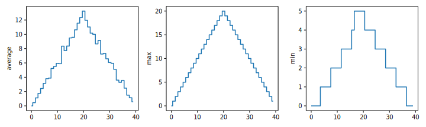

::::::::::::::::::::::::::::::::::::::: objectives

- Test your knowledge on these tasks

::::::::::::::::::::::::::::::::::::::::::::::::::

:::::::::::::::::::::::::::::::::::::::: questions

- How much did I learn over the past two days?

::::::::::::::::::::::::::::::::::::::::::::::::::


:::::::::::::::::::::::::::::::::::::::  challenge

## Sorting Out References

Python allows you to assign multiple values to multiple variables in one line by separating
the variables and values with commas. What does the following program display to the console?

```python
first, second = 'Grace', 'Hopper'
third, fourth = second, first
print(third, fourth)
```

:::::::::::::::  solution

## Solution

```output
Hopper Grace
```

:::::::::::::::::::::::::

::::::::::::::::::::::::::::::::::::::::::::::::::

:::::::::::::::::::::::::::::::::::::::  challenge

## Seeing Data Types

What are the data types of the following variables?

```python
planet = 'Earth'
apples = 5
distance = 10.5
```

:::::::::::::::  solution

## Solution

```python
print(type(planet))
print(type(apples))
print(type(distance))
```

```output
<class 'str'>
<class 'int'>
<class 'float'>
```

:::::::::::::::::::::::::

::::::::::::::::::::::::::::::::::::::::::::::::::

:::::::::::::::::::::::::::::::::::::::  challenge

## Slicing Strings

A section of an array is called a [slice](../learners/reference.md#slice).
We can take slices of character strings as well:

```python
element = 'oxygen'
print('first three characters:', element[0:3])
print('last three characters:', element[3:6])
```

```output
first three characters: oxy
last three characters: gen
```

What is the value of `element[:4]`?
What about `element[4:]`?
Or `element[:]`?

:::::::::::::::  solution

## Solution

```output
oxyg
en
oxygen
```

:::::::::::::::::::::::::

What is `element[-1]`?
What is `element[-2]`?

:::::::::::::::  solution

## Solution

```output
n
e
```

:::::::::::::::::::::::::

Given those answers,
explain what `element[1:-1]` does.

:::::::::::::::  solution

## Solution

Creates a substring from index 1 up to (not including) the final index,
effectively removing the first and last letters from 'oxygen'


:::::::::::::::::::::::::

How can we rewrite the slice for getting the last three characters of `element`,
so that it works even if we assign a different string to `element`?
Test your solution with the following strings: `carpentry`, `clone`, `hi`.

:::::::::::::::  solution

## Solution

```python
element = 'oxygen'
print('last three characters:', element[-3:])
element = 'carpentry'
print('last three characters:', element[-3:])
element = 'clone'
print('last three characters:', element[-3:])
element = 'hi'
print('last three characters:', element[-3:])
```

```output
last three characters: gen
last three characters: try
last three characters: one
last three characters: hi
```

:::::::::::::::::::::::::

::::::::::::::::::::::::::::::::::::::::::::::::::

:::::::::::::::::::::::::::::::::::::::  challenge

## Overloading

`+` usually means addition, but when used on strings or lists, it means "concatenate".
Given that, what do you think the multiplication operator `*` does on lists?
In particular, what will be the output of the following code?

```python
counts = [2, 4, 6, 8, 10]
repeats = counts * 2
print(repeats)
```

1. `[2, 4, 6, 8, 10, 2, 4, 6, 8, 10]`
2. `[4, 8, 12, 16, 20]`
3. `[[2, 4, 6, 8, 10], [2, 4, 6, 8, 10]]`
4. `[2, 4, 6, 8, 10, 4, 8, 12, 16, 20]`

The technical term for this is *operator overloading*:
a single operator, like `+` or `*`,
can do different things depending on what it's applied to.

:::::::::::::::  solution

## Solution

The multiplication operator `*` used on a list replicates elements of the list and concatenates
them together:

```output
[2, 4, 6, 8, 10, 2, 4, 6, 8, 10]
```

It's equivalent to:

```python
counts + counts
```

:::::::::::::::::::::::::

::::::::::::::::::::::::::::::::::::::::::::::::::


:::::::::::::::::::::::::::::::::::::::  challenge

## Thin Slices

The expression `element[3:3]` produces an
[empty string](../learners/reference.md#empty-string),
i.e., a string that contains no characters.
If `data` holds our array of patient data,
what does `data[3:3, 4:4]` produce?
What about `data[3:3, :]`?

:::::::::::::::  solution

## Solution

```output
array([], shape=(0, 0), dtype=float64)
array([], shape=(0, 40), dtype=float64)
```

:::::::::::::::::::::::::

::::::::::::::::::::::::::::::::::::::::::::::::::

:::::::::::::::::::::::::::::::::::::::  challenge

## Stacking Arrays

Arrays can be concatenated and stacked on top of one another,
using NumPy's `vstack` and `hstack` functions for vertical and horizontal stacking, respectively.

```python
import numpy

A = numpy.array([[1, 2, 3], [4, 5, 6], [7, 8, 9]])
print('A = ')
print(A)

B = numpy.hstack([A, A])
print('B = ')
print(B)

C = numpy.vstack([A, A])
print('C = ')
print(C)
```

```output
A =
[[1 2 3]
 [4 5 6]
 [7 8 9]]
B =
[[1 2 3 1 2 3]
 [4 5 6 4 5 6]
 [7 8 9 7 8 9]]
C =
[[1 2 3]
 [4 5 6]
 [7 8 9]
 [1 2 3]
 [4 5 6]
 [7 8 9]]
```

Write some additional code that slices the first and last columns of `A`,
and stacks them into a 3x2 array.
Make sure to `print` the results to verify your solution.

:::::::::::::::  solution

## Solution

A 'gotcha' with array indexing is that singleton dimensions
are dropped by default. That means `A[:, 0]` is a one dimensional
array, which won't stack as desired. To preserve singleton dimensions,
the index itself can be a slice or array. For example, `A[:, :1]` returns
a two dimensional array with one singleton dimension (i.e. a column
vector).

```python
D = numpy.hstack((A[:, :1], A[:, -1:]))
print('D = ')
print(D)
```

```output
D =
[[1 3]
 [4 6]
 [7 9]]
```

:::::::::::::::::::::::::

:::::::::::::::  solution

## Solution

An alternative way to achieve the same result is to use Numpy's
delete function to remove the second column of A. If you're not
sure what the parameters of numpy.delete mean, use the help files.

```python
D = numpy.delete(arr=A, obj=1, axis=1)
print('D = ')
print(D)
```

```output
D =
[[1 3]
 [4 6]
 [7 9]]
```

:::::::::::::::::::::::::

::::::::::::::::::::::::::::::::::::::::::::::::::

:::::::::::::::::::::::::::::::::::::::  challenge

## Change In Inflammation

The patient data is *longitudinal* in the sense that each row represents a
series of observations relating to one individual.  This means that
the change in inflammation over time is a meaningful concept.
Let's find out how to calculate changes in the data contained in an array
with NumPy.

The `numpy.diff()` function takes an array and returns the differences
between two successive values. Let's use it to examine the changes
each day across the first week of patient 3 from our inflammation dataset.

```python
patient3_week1 = data[3, :7]
print(patient3_week1)
```

```output
 [0. 0. 2. 0. 4. 2. 2.]
```

Calling `numpy.diff(patient3_week1)` would do the following calculations

```python
[ 0 - 0, 2 - 0, 0 - 2, 4 - 0, 2 - 4, 2 - 2 ]
```

and return the 6 difference values in a new array.

```python
numpy.diff(patient3_week1)
```

```output
array([ 0.,  2., -2.,  4., -2.,  0.])
```

Note that the array of differences is shorter by one element (length 6).

When calling `numpy.diff` with a multi-dimensional array, an `axis` argument may
be passed to the function to specify which axis to process. When applying
`numpy.diff` to our 2D inflammation array `data`, which axis would we specify?

:::::::::::::::  solution

## Solution

Since the row axis (0) is patients, it does not make sense to get the
difference between two arbitrary patients. The column axis (1) is in
days, so the difference is the change in inflammation -- a meaningful
concept.

```python
numpy.diff(data, axis=1)
```

:::::::::::::::::::::::::

If the shape of an individual data file is `(60, 40)` (60 rows and 40
columns), what would the shape of the array be after you run the `diff()`
function and why?

:::::::::::::::  solution

## Solution

The shape will be `(60, 39)` because there is one fewer difference between
columns than there are columns in the data.


:::::::::::::::::::::::::

How would you find the largest change in inflammation for each patient? Does
it matter if the change in inflammation is an increase or a decrease?

:::::::::::::::  solution

## Solution

By using the `numpy.amax()` function after you apply the `numpy.diff()`
function, you will get the largest difference between days.

```python
numpy.amax(numpy.diff(data, axis=1), axis=1)
```

```python
array([  7.,  12.,  11.,  10.,  11.,  13.,  10.,   8.,  10.,  10.,   7.,
         7.,  13.,   7.,  10.,  10.,   8.,  10.,   9.,  10.,  13.,   7.,
        12.,   9.,  12.,  11.,  10.,  10.,   7.,  10.,  11.,  10.,   8.,
        11.,  12.,  10.,   9.,  10.,  13.,  10.,   7.,   7.,  10.,  13.,
        12.,   8.,   8.,  10.,  10.,   9.,   8.,  13.,  10.,   7.,  10.,
         8.,  12.,  10.,   7.,  12.])
```

If inflammation values *decrease* along an axis, then the difference from
one element to the next will be negative. If
you are interested in the **magnitude** of the change and not the
direction, the `numpy.absolute()` function will provide that.

Notice the difference if you get the largest *absolute* difference
between readings.

```python
numpy.amax(numpy.absolute(numpy.diff(data, axis=1)), axis=1)
```

```python
array([ 12.,  14.,  11.,  13.,  11.,  13.,  10.,  12.,  10.,  10.,  10.,
        12.,  13.,  10.,  11.,  10.,  12.,  13.,   9.,  10.,  13.,   9.,
        12.,   9.,  12.,  11.,  10.,  13.,   9.,  13.,  11.,  11.,   8.,
        11.,  12.,  13.,   9.,  10.,  13.,  11.,  11.,  13.,  11.,  13.,
        13.,  10.,   9.,  10.,  10.,   9.,   9.,  13.,  10.,   9.,  10.,
        11.,  13.,  10.,  10.,  12.])
```

:::::::::::::::::::::::::

::::::::::::::::::::::::::::::::::::::::::::::::::

:::::::::::::::::::::::::::::::::::::::  challenge

## From 1 to N

Python has a built-in function called `range` that generates a sequence of numbers. `range` can
accept 1, 2, or 3 parameters.

- If one parameter is given, `range` generates a sequence of that length,
  starting at zero and incrementing by 1.
  For example, `range(3)` produces the numbers `0, 1, 2`.
- If two parameters are given, `range` starts at
  the first and ends just before the second, incrementing by one.
  For example, `range(2, 5)` produces `2, 3, 4`.
- If `range` is given 3 parameters,
  it starts at the first one, ends just before the second one, and increments by the third one.
  For example, `range(3, 10, 2)` produces `3, 5, 7, 9`.

Using `range`,
write a loop that prints the first 3 natural numbers:

```python
1
2
3
```

:::::::::::::::  solution

## Solution

```python
for number in range(1, 4):
    print(number)
```

:::::::::::::::::::::::::

::::::::::::::::::::::::::::::::::::::::::::::::::

:::::::::::::::::::::::::::::::::::::::  challenge

## Understanding the loops

Given the following loop:

```python
word = 'oxygen'
for letter in word:
    print(letter)
```

How many times is the body of the loop executed?

- 3 times
- 4 times
- 5 times
- 6 times

:::::::::::::::  solution

## Solution

The body of the loop is executed 6 times.

:::::::::::::::::::::::::

::::::::::::::::::::::::::::::::::::::::::::::::::

:::::::::::::::::::::::::::::::::::::::  challenge

## Computing Powers With Loops

Exponentiation is built into Python:

```python
print(5 ** 3)
```

```output
125
```

Write a loop that calculates the same result as `5 ** 3` using
multiplication (and without exponentiation).

:::::::::::::::  solution

## Solution

```python
result = 1
for number in range(0, 3):
    result = result * 5
print(result)
```

:::::::::::::::::::::::::

::::::::::::::::::::::::::::::::::::::::::::::::::

:::::::::::::::::::::::::::::::::::::::  challenge

## Summing a list

Write a loop that calculates the sum of elements in a list
by adding each element and printing the final value,
so `[124, 402, 36]` prints 562

:::::::::::::::  solution

## Solution

```python
numbers = [124, 402, 36]
summed = 0
for num in numbers:
    summed = summed + num
print(summed)
```

:::::::::::::::::::::::::

::::::::::::::::::::::::::::::::::::::::::::::::::

:::::::::::::::::::::::::::::::::::::::  challenge

## Computing the Value of a Polynomial

The built-in function `enumerate` takes a sequence (e.g. a [list](04-lists.md)) and
generates a new sequence of the same length. Each element of the new sequence is a pair composed
of the index (0, 1, 2,...) and the value from the original sequence:

```python
for idx, val in enumerate(a_list):
    # Do something using idx and val
```

The code above loops through `a_list`, assigning the index to `idx` and the value to `val`.

Suppose you have encoded a polynomial as a list of coefficients in
the following way: the first element is the constant term, the
second element is the coefficient of the linear term, the third is the
coefficient of the quadratic term, where the polynomial is of the form $ax^0 + bx^1 + cx^2$.

```python
x = 5
coefs = [2, 4, 3]
y = coefs[0] * x**0 + coefs[1] * x**1 + coefs[2] * x**2
print(y)
```

```output
97
```

Write a loop using `enumerate(coefs)` which computes the value `y` of any
polynomial, given `x` and `coefs`.

:::::::::::::::  solution

## Solution

```python
y = 0
for idx, coef in enumerate(coefs):
    y = y + coef * x**idx
```

:::::::::::::::::::::::::

::::::::::::::::::::::::::::::::::::::::::::::::::

:::::::::::::::::::::::::::::::::::::::  challenge

## Plot Scaling

Why do all of our plots stop just short of the upper end of our graph?

:::::::::::::::  solution

## Solution

Because matplotlib normally sets x and y axes limits to the min and max of our data
(depending on data range)


:::::::::::::::::::::::::

If we want to change this, we can use the `set_ylim(min, max)` method of each 'axes',
for example:

```python
axes3.set_ylim(0, 6)
```

Update your plotting code to automatically set a more appropriate scale.
(Hint: you can make use of the `max` and `min` methods to help.)

:::::::::::::::  solution

## Solution

```python
# One method
axes3.set_ylabel('min')
axes3.plot(numpy.amin(data, axis=0))
axes3.set_ylim(0, 6)
```

:::::::::::::::::::::::::

:::::::::::::::  solution

## Solution

```python
# A more automated approach
min_data = numpy.amin(data, axis=0)
axes3.set_ylabel('min')
axes3.plot(min_data)
axes3.set_ylim(numpy.amin(min_data), numpy.amax(min_data) * 1.1)
```

:::::::::::::::::::::::::

::::::::::::::::::::::::::::::::::::::::::::::::::

:::::::::::::::::::::::::::::::::::::::  challenge

## Drawing Straight Lines

In the center and right subplots above, we expect all lines to look like step functions because
non-integer values are not realistic for the minimum and maximum values. However, you can see
that the lines are not always vertical or horizontal, and in particular the step function
in the subplot on the right looks slanted. Why is this?

:::::::::::::::  solution

## Solution

Because matplotlib interpolates (draws a straight line) between the points.
One way to do avoid this is to use the Matplotlib `drawstyle` option:

```python
import numpy
import matplotlib.pyplot

data = numpy.loadtxt(fname='inflammation-01.csv', delimiter=',')

fig = matplotlib.pyplot.figure(figsize=(10.0, 3.0))

axes1 = fig.add_subplot(1, 3, 1)
axes2 = fig.add_subplot(1, 3, 2)
axes3 = fig.add_subplot(1, 3, 3)

axes1.set_ylabel('average')
axes1.plot(numpy.mean(data, axis=0), drawstyle='steps-mid')

axes2.set_ylabel('max')
axes2.plot(numpy.amax(data, axis=0), drawstyle='steps-mid')

axes3.set_ylabel('min')
axes3.plot(numpy.amin(data, axis=0), drawstyle='steps-mid')

fig.tight_layout()

matplotlib.pyplot.show()
```

{alt='Three line graphs, with step lines connecting the points, showing the daily average, maximumand minimum inflammation over a 40-day period.'}


:::::::::::::::::::::::::

::::::::::::::::::::::::::::::::::::::::::::::::::

:::::::::::::::::::::::::::::::::::::::  challenge

## Make Your Own Plot

Create a plot showing the standard deviation (`numpy.std`)
of the inflammation data for each day across all patients.

:::::::::::::::  solution

## Solution

```python
std_plot = matplotlib.pyplot.plot(numpy.std(data, axis=0))
matplotlib.pyplot.show()
```

:::::::::::::::::::::::::

::::::::::::::::::::::::::::::::::::::::::::::::::

:::::::::::::::::::::::::::::::::::::::  challenge

## Moving Plots Around

Modify the program to display the three plots on top of one another
instead of side by side.

:::::::::::::::  solution

## Solution

```python
import numpy
import matplotlib.pyplot

data = numpy.loadtxt(fname='inflammation-01.csv', delimiter=',')

# change figsize (swap width and height)
fig = matplotlib.pyplot.figure(figsize=(3.0, 10.0))

# change add_subplot (swap first two parameters)
axes1 = fig.add_subplot(3, 1, 1)
axes2 = fig.add_subplot(3, 1, 2)
axes3 = fig.add_subplot(3, 1, 3)

axes1.set_ylabel('average')
axes1.plot(numpy.mean(data, axis=0))

axes2.set_ylabel('max')
axes2.plot(numpy.amax(data, axis=0))

axes3.set_ylabel('min')
axes3.plot(numpy.amin(data, axis=0))

fig.tight_layout()

matplotlib.pyplot.show()
```

:::::::::::::::::::::::::

::::::::::::::::::::::::::::::::::::::::::::::::::

:::::::::::::::::::::::::::::::::::::::: keypoints

- Practice makes perfect.

::::::::::::::::::::::::::::::::::::::::::::::::::


